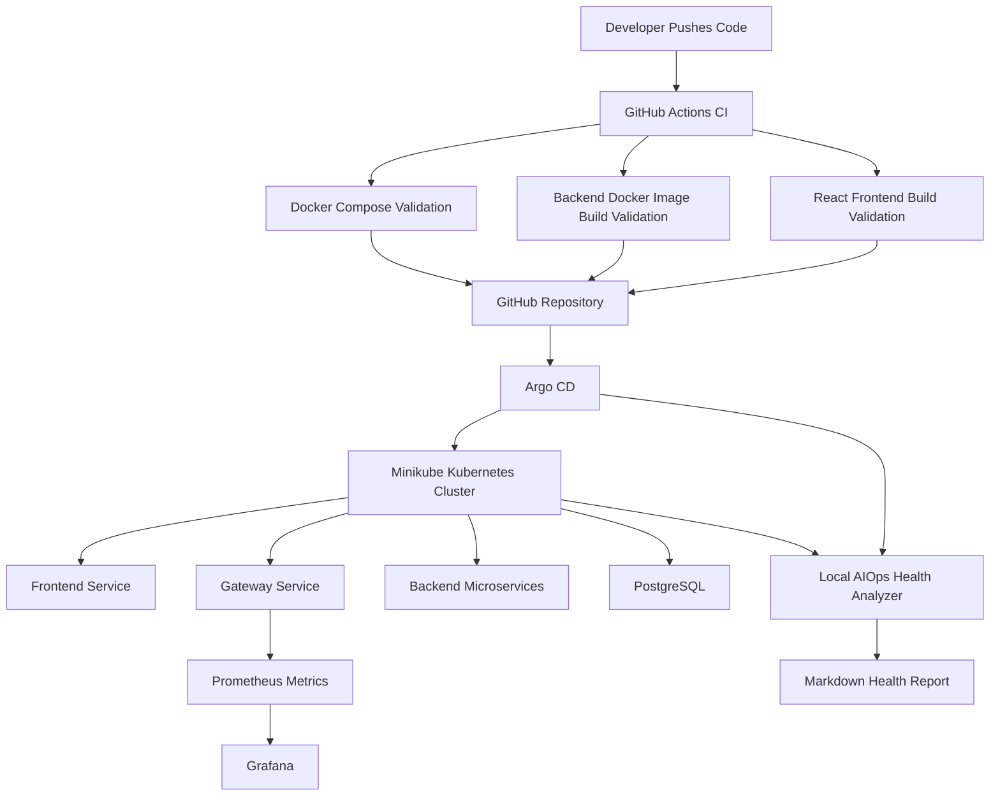
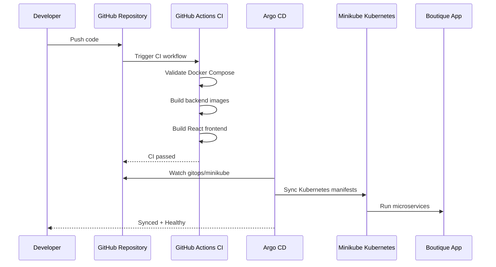

# AI-Powered DevOps Automation — No-AWS Local Edition


A complete DevOps + AIOps project for a boutique microservices application.

This fork keeps the original AWS EKS and AWS Bedrock architecture as a future-ready reference, but the completed implementation runs locally with zero AWS cost using Docker, GitHub Actions, Minikube, Argo CD, Prometheus/Grafana, and a local AIOps health analyzer.

---

## Project Summary

This project demonstrates how a microservices application can move through a real DevOps workflow:

- Build and run locally with Docker Compose
- Validate builds with GitHub Actions CI
- Deploy to Kubernetes using Minikube
- Continuously sync Kubernetes manifests using Argo CD GitOps
- Monitor the system using Prometheus/Grafana
- Analyze Kubernetes health using a local No-AWS AIOps script

No AWS resources were deployed, so the project avoids cloud cost while still showing a realistic CI/CD, Kubernetes, GitOps, observability, and AIOps workflow.

---

## Final Implementation Status

| Capability | Tool / Technology | Status |
|---|---|---|
| Local microservices deployment | Docker Compose | Completed |
| Frontend application | React | Completed |
| Backend microservices | Node.js | Completed |
| Database | PostgreSQL | Completed |
| Database seed/restore | SQL + Kubernetes Job | Completed |
| CI pipeline | GitHub Actions | Completed |
| Kubernetes deployment | Minikube | Completed |
| GitOps continuous delivery | Argo CD | Completed |
| Manifest customization | Kustomize | Completed |
| Metrics endpoint | Prometheus format | Completed |
| Local dashboards | Grafana | Completed |
| AIOps health analyzer | Python + kubectl | Completed |
| AWS EKS deployment | Future-ready only | Not deployed to avoid cost |
| AWS Bedrock AIOps | Future-ready only | Replaced with local analyzer |

---

## High-Level Architecture



---

## CI/CD and GitOps Flow



---

## Tech Stack

| Layer | Technology |
|---|---|
| Frontend | React |
| Backend | Node.js microservices |
| Database | PostgreSQL |
| Containers | Docker, Docker Compose |
| CI | GitHub Actions |
| Kubernetes | Minikube |
| GitOps / CD | Argo CD |
| Kubernetes customization | Kustomize |
| Monitoring | Prometheus, Grafana |
| AIOps | Local Python health analyzer |
| Cloud-readiness | AWS EKS, AWS Bedrock, Terraform references retained |

---

## Repository Structure

```text
.
├── .github/
│   └── workflows/
│       └── local-ci.yml
│
├── docs/
│   ├── claude-setup.md
│   ├── part1-system-design.md
│   └── part2-workflow.md
│
├── gitops/
│   ├── argocd/
│   │   └── boutique-minikube-app.yml
│   ├── minikube/
│   │   └── kustomization.yml
│   ├── k8s/
│   │   ├── backend/
│   │   ├── database/
│   │   └── frontend/
│   └── kustomization.yml
│
├── projects/
│   ├── boutique-microservices/
│   ├── local-aiops/
│   │   ├── aiops_health_check.py
│   │   ├── README.md
│   │   └── reports/
│   │       └── cluster-health-report.md
│   ├── aiops-assistant/
│   └── Infrastructure/
│
└── README.md
```

---

## Application Services

| Service | Purpose | Local Port / Access |
|---|---|---|
| Frontend | React UI for boutique app | `localhost:3000` |
| Gateway | API gateway and metrics endpoint | `localhost:3001` |
| Auth Service | Authentication service | Internal Kubernetes service |
| Product Service | Product catalog API | Internal Kubernetes service |
| Orders Service | Orders API | Internal Kubernetes service |
| Order Management Service | Order management logic | Internal Kubernetes service |
| User Service | User profile service | Internal Kubernetes service |
| PostgreSQL | Application database | Internal Kubernetes service |
| Prometheus | Metrics collection | `localhost:9090` in Docker Compose |
| Grafana | Dashboards | `localhost:3007` in Docker Compose |
| Argo CD | GitOps continuous delivery | `localhost:8080` via port-forward |

---

## GitHub Actions CI

The No-AWS CI workflow runs on every push and pull request to `main`.

Workflow file:

```text
.github/workflows/local-ci.yml
```

The workflow validates:

- Docker Compose configuration
- Backend Docker image builds
- React frontend dependency installation
- React frontend production build

Current workflow:

```text
Local No-AWS CI
```

Expected result:

```text
Passed / Green
```

---

## Local Docker Compose Setup

Go to the application folder:

```powershell
cd projects\boutique-microservices
```

Start the app:

```powershell
docker compose -f docker-compose.yml up -d --build
```

Useful local URLs:

```text
Frontend: http://localhost:3000
Gateway metrics: http://localhost:3001/metrics
Prometheus: http://localhost:9090
Grafana: http://localhost:3007
```

Stop Docker Compose:

```powershell
docker compose -f docker-compose.yml down
```

---

## Local Kubernetes with Minikube

Start Minikube:

```powershell
minikube start --driver=docker --cpus=3 --memory=4096
```

Point Docker to Minikube’s Docker environment:

```powershell
minikube docker-env --shell powershell | Invoke-Expression
```

Build local images:

```powershell
docker build -t boutique-auth:local .\projects\boutique-microservices\backend\services\auth
docker build -t boutique-gateway:local .\projects\boutique-microservices\backend\services\gateway
docker build -t boutique-orders:local .\projects\boutique-microservices\backend\services\orders
docker build -t boutique-order-service:local .\projects\boutique-microservices\backend\services\order-service
docker build -t boutique-product-service:local .\projects\boutique-microservices\backend\services\product-service
docker build -t boutique-user-service:local .\projects\boutique-microservices\backend\services\user-service
docker build -t boutique-frontend:local .\projects\boutique-microservices\frontend
```

Apply the Minikube overlay:

```powershell
kubectl kustomize --load-restrictor=LoadRestrictionsNone .\gitops\minikube | kubectl apply -f -
```

Restore/seed the database:

```powershell
kubectl apply -f .\gitops\k8s\database\restore-job.yml
kubectl wait --for=condition=complete job/boutique-db-restore -n boutique --timeout=180s
```

Check application pods:

```powershell
kubectl get pods -n boutique
```

Expected:

```text
auth                         Running
boutique-postgres            Running
frontend                     Running
gateway                      Running
order-service                Running
orders                       Running
product-service              Running
user-service                 Running
boutique-db-restore          Completed
```

---

## Access the Application from Minikube

Frontend:

```powershell
kubectl port-forward svc/frontend 3000:3000 -n boutique
```

Open:

```text
http://localhost:3000
```

Gateway:

```powershell
kubectl port-forward svc/gateway 3001:3001 -n boutique
```

Open:

```text
http://localhost:3001/metrics
http://localhost:3001/api/products
```

---

## Argo CD GitOps Setup

Argo CD is used for GitOps-based continuous delivery.

Application manifest:

```text
gitops/argocd/boutique-minikube-app.yml
```

It watches:

```text
gitops/minikube
```

Expected Argo CD application status:

```text
Synced
Healthy
```

Check with:

```powershell
kubectl get applications -n argocd
kubectl get application boutique-minikube -n argocd -o wide
```

---

## Argo CD UI

Port-forward Argo CD:

```powershell
kubectl port-forward svc/argocd-server -n argocd 8080:443
```

Open:

```text
https://localhost:8080
```

Username:

```text
admin
```

Get password:

```powershell
kubectl get secret argocd-initial-admin-secret -n argocd -o jsonpath="{.data.password}" | %{ [System.Text.Encoding]::UTF8.GetString([Convert]::FromBase64String($_)) }
```

---

## Local No-AWS AIOps Health Analyzer

The local AIOps analyzer checks Kubernetes and Argo CD health without AWS Bedrock.

Script:

```text
projects/local-aiops/aiops_health_check.py
```

Run:

```powershell
python .\projects\local-aiops\aiops_health_check.py
```

Generated report:

```text
projects/local-aiops/reports/cluster-health-report.md
```

The report includes:

- Overall health status
- Argo CD sync and health status
- Boutique pod status
- Restart counts
- CrashLoopBackOff/Error detection
- Recent Kubernetes events
- Incident-style recommendation

### AIOps Status Levels

| Status | Meaning |
|---|---|
| `HEALTHY` | Application is running normally |
| `WATCH` | Application is running, but warnings or restart counts should be monitored |
| `ATTENTION_REQUIRED` | One or more components are unhealthy |

Example output:

```text
Overall status: WATCH
Argo CD: Synced and Healthy
Recommendation: Monitor pods because restart counts are elevated
```

---

## Operational Validation Completed

The following validations were completed:

| Test | Result |
|---|---|
| Docker Compose app started locally | Passed |
| Products page showed seeded products | Passed |
| Gateway metrics endpoint returned Prometheus metrics | Passed |
| Grafana opened locally | Passed |
| GitHub Actions CI passed | Passed |
| Minikube pods reached Running state | Passed |
| Products API worked through Kubernetes port-forward | Passed |
| Argo CD showed Synced + Healthy | Passed |
| GitOps validation sync completed | Passed |
| Local AIOps analyzer generated health report | Passed |

---

## No-AWS Scope

This implementation intentionally avoids AWS deployment to prevent cloud charges.

Completed locally:

- Docker Compose deployment
- GitHub Actions CI
- Minikube Kubernetes deployment
- Argo CD GitOps CD
- Prometheus/Grafana observability
- Local AIOps health analyzer

Optional future AWS scope:

- AWS EKS deployment
- AWS ECR image publishing
- Terraform AWS infrastructure provisioning
- AWS Bedrock Agent integration
- CloudWatch log forwarding

The project is AWS-ready, but the completed implementation proves the DevOps workflow locally at zero cloud cost.

---

## Troubleshooting Notes

### Minikube API timeout

If `kubectl` shows a TLS handshake timeout, Minikube may be overloaded.

Try:

```powershell
minikube stop
minikube start --driver=docker --cpus=3 --memory=4096
```

Then check:

```powershell
kubectl get nodes
kubectl get pods -n boutique
kubectl get applications -n argocd
```

### Port-forward not working

`localhost` URLs only work while the related port-forward command is running.

Frontend:

```powershell
kubectl port-forward svc/frontend 3000:3000 -n boutique
```

Argo CD:

```powershell
kubectl port-forward svc/argocd-server -n argocd 8080:443
```

### Completed restore job

The database restore pod showing `Completed` is normal.

```text
boutique-db-restore   Completed
```

It is a Kubernetes Job, so it should finish after restoring/creating database content.

---

## Resume Bullet

```text
Built a No-AWS DevOps automation platform for a microservices e-commerce app using Docker, GitHub Actions CI, Minikube Kubernetes, Argo CD GitOps CD, Prometheus/Grafana observability, and a local AIOps health analyzer.
```

---

## Interview Summary

This project demonstrates a complete local DevOps workflow for a microservices application.

GitHub Actions validates the build, Minikube runs the Kubernetes cluster locally, Argo CD continuously syncs Kubernetes manifests from Git, Prometheus/Grafana provide observability, and the local AIOps analyzer generates Kubernetes health reports without requiring AWS Bedrock or paid cloud resources.
